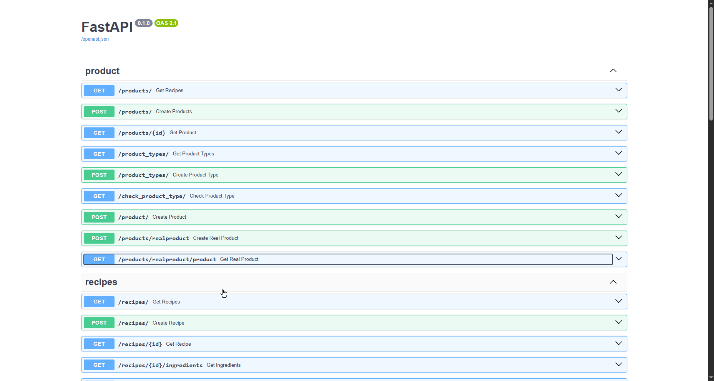

# Smart Recipes

**Smart Recipes** – это мобильное приложение для поиска и добавления рецептов, основанное на продуктах, которые есть у пользователя.  
Приложение позволяет хранить список продуктов («холодильник»), находить рецепты, исходя из доступных ингредиентов, сохранять понравившиеся блюда и добавлять собственные рецепты.  

[пример работы «общий обзор приложения»]  

## 📑 Оглавление
- [✨ Основные возможности](#-основные-возможности)
- [📱 Экранная структура](#-экранная-структура)
  - [🏠 Домашний экран](#-домашний-экран)
  - [➕ Экран добавления рецептов](#-экран-добавления-рецептов)
  - [🔍 Экран поиска](#-экран-поиска)
  - [🧊 Экран «Холодильник»](#-экран-холодильник)
- [⚙️ Техническая часть](#️-техническая-часть)
- [🚀 Установка и запуск](#-установка-и-запуск)
  - [📲 Вариант 1. Сборка проекта вручную](#-вариант-1-сборка-проекта-вручную)
  - [📥 Вариант 2. Установка из вкладки Releases](#-вариант-2-установка-из-вкладки-releases)
- [📝 Планируемые изменения (TODO)](#-планируемые-изменения-todo)
- [⚠️ Примечания к проекту](#️-примечания-к-проекту)


## ✨ Основные возможности

- 🔍 Поиск рецептов по продуктам  
- 🥗 Хранение списка ингредиентов в «Холодильнике»  
- ❤️ Сохранение любимых рецептов  
- ➕ Добавление собственных рецептов (ингредиенты, шаги, фото)  
- 📷 Сканирование штрихкодов продуктов для быстрого добавления  
- 🎨 Поддержка светлой и тёмной темы интерфейса, автоматическое переключение в зависимости от системных настроек устройства


## 📱 Экранная структура

### 🏠 Домашний экран
- Популярные рецепты  
- Недавно добавленные рецепты  
- Кнопка для перехода на экран добавления рецепта  


### ➕ Экран добавления рецептов
- Добавление основной картинки рецепта  
- Добавление ингредиентов через диалоговое окно (продукт, количество, единицы измерения: мл, гр, шт, ч.л., ст.л. и т.д.)  
- Возможность добавить новый продукт в базу через «добавить продукт»  
- Добавление шагов приготовления (текст + опциональное изображение)  
- Указание калорийности и времени приготовления  
- Кнопка «Добавить рецепт» для сохранения в базе данных  


### 🔍 Экран поиска
Содержит три вкладки:  

- **Поиск** – список всех рецептов.  
  - Отображается:  
    - (количество доступных продуктов / количество ингредиентов)  
    - время приготовления  
    - калорийность  
  - Возможность сохранить рецепт (сердце ❤️) → рецепт попадёт во вкладку «Сохранённые»  
  - При открытии рецепта:  
    - ингредиенты (состояние: ✅ есть у пользователя / ❌ отсутствует)  
    - шаги приготовления  

- **Сейчас** – рецепты, которые можно приготовить прямо сейчас (все ингредиенты доступны в холодильнике).  

- **Сохранённые** – список сохранённых рецептов. Повторное нажатие на ❤️ удаляет рецепт из памяти.  


### 🧊 Экран «Холодильник»
- Отображение списка продуктов пользователя  
- Удаление и добавление продуктов  
- Способы добавления:  
  1. **Поиск продукта** – диалоговое окно с поиском по базе  
  2. **Сканирование штрихкода** – открывается сканер, штрихкод проверяется в базе приложения  
     - Если продукт отсутствует, загружается информация с [ean-online.ru](https://ean-online.ru/)  
     - Пользователь выбирает эквивалентный продукт  
     - Штрихкод сохраняется для будущего быстрого добавления  


## ⚙️ Техническая часть

### Backend
- **База данных**: **PostgreSQL**  
  - Основные таблицы: `recipes`, `ingredients`, `user_products`, `saved_recipes`  
  - Связи: многие-ко-многим между рецептами и ингредиентами  
  - Поддержка миграций (при необходимости)  
  - **Скриншот диаграммы базы данных**:  
      

- **API**: **SmartRecipes API (FastAPI + Python)**  
  - Основные эндпоинты:  
    - `/product` – работа с продуктами, сопоставление штрихкода реально продукта с эквивалентом в базе данных 
    - `/recipes` – работа с рецептами 
  - Поддержка загрузки изображений через [imgbb.com](https://imgbb.com/) 
  - **Документация API**: [Ссылка на docs](http://45.43.91.214:9999/docs#/)

      

- **Дополнительный сервис**: **[ean-online.ru API](https://ean-online.ru/)**  
  - Получение информации о продукте по штрихкоду  

### Frontend (Android)
- **Язык**: Kotlin  
- **Архитектура**: Clean Architecture  
  - **Presentation** – UI и ViewModel  
  - **Domain** – бизнес-логика приложения  
  - **Data** – работа с API, локальная база данных и репозитории  
- **DI**: Dagger Hilt, покрывает все слои приложения  
- **Работа с сетью**:  
  - Retrofit + OkHttp3  
  - Конвертеры: `kotlinx-serialization-json`, `retrofit2-kotlinx-serialization-converter`  
- **Загрузка изображений**: Picasso  
- **UI**:  
  - Модуль `menuCircle` – выдвижное круговое меню на базе DrawerLayout  
  - Конфигурация через `menu_items.xml`  
  - Используются RecyclerView, CardView и другие стандартные компоненты для списков и карточек
  - для генерации вёрстки шагов рецепта, списка ингридиентов используется самописный адаптер
  


### Дополнительно
- Версии SDK: Android 8.0+  
- Поддержка локального кеширования данных (SharedPreferences)  
- Возможность масштабирования архитектуры благодаря слоистой структуре Clean Architecture  
- Легкая интеграция новых API и модулей благодаря DI через Hilt  


## 🚀 Установка и запуск

### 📲 Вариант 1. Сборка проекта вручную
1. Склонировать репозиторий:  
   ```bash
   git clone https://github.com/username/smart-recipes.git
2. Открыть проект в Android Studio
3. Дождаться синхронизации зависимостей Gradle
4. Запустить приложение на эмуляторе или реальном устройстве (рекомендуется Android 8.0+)

### 📥 Вариант 2. Установка из вкладки Releases

1. Перейти в раздел Releases в репозитории проекта
2. Скачать готовый APK файл последней версии
3. Установить APK на устройство

 - В настройках устройства может потребоваться разрешить установку приложений из неизвестных источников
 ## 📝 Планируемые изменения (TODO)

- **Регистрация и авторизация пользователей**  
  - Возможность создать аккаунт или войти через email / пароль / номер телефона
  - Сохранение персональных данных, любимых рецептов и продуктов  

- **Дополнительные действия пользователя** 
  - Комментирование рецептов  
  - Оценка рецептов (лайки, рейтинг)  
  - Возможность делиться рецептами с друзьями  

- **Улучшения во вкладке поиска рецептов**  
  - Кнопка **Поиск** для быстрого фильтрования рецептов  
  - **Фильтрация** по параметрам: калорийность, время приготовления, категория блюда, наличие ингредиентов  
  - **Сортировка** рецептов: по популярности, времени приготовления, калорийности  

- **UI / UX улучшения**  
  - Улучшенная анимация при добавлении рецептов и ингредиентов
  - Переработать [дизайн проекта](https://www.figma.com/design/rmzwXauBRxnqUlSnqvkc4D/SmartRecipes?m=auto&t=zWXsLxk4kUUzdlTo-1)

## ⚠️ Примечания к проекту

- На текущий момент проект **Smart Recipes** является демонстрацией концепции поиска рецептов **не по названию, а по продуктам**.  
- Приложение предоставляет **минимальный функционал**, достаточный для тестирования идеи и основных взаимодействий с интерфейсом.  
- Некоторые возможности (например, регистрация, расширенная фильтрация и сортировка) находятся в стадии планирования и могут быть реализованы в будущих версиях.  
- Основная цель проекта на данном этапе — показать **логику подбора рецептов по имеющимся продуктам** и базовое взаимодействие пользователя с приложением.
